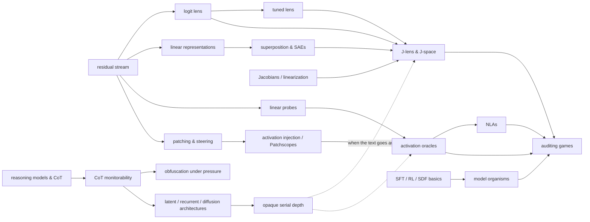

# Concept map

Status: `·` not started · `~` exposed · `✓` can explain it back · `★` can use it / critique it

Each explainer declares which nodes it needs and which it unlocks, and the map gets updated after every
delivered piece. All statuses stay `·` until `profile.md` is filled in, and some foundations will start at `✓`.

| concept | status | needs | covered by |
|---|---|---|---|
| residual stream | · | transformer forward pass | `residual-stream-lenses` |
| logit lens → tuned lens | · | residual stream, unembedding | `residual-stream-lenses` |
| linear representations, SAEs | · | residual stream | (background) |
| Jacobians / linearization | · | multivariable calculus | `j-lens` |
| J-lens & J-space | · | logit/tuned lens, Jacobians, SAEs | `j-lens` |
| activation injection → activation oracles | · | patching, probes, SFT | `readers-that-talk` |
| NLAs | · | AOs, autoencoders/FVE, RL+KL | `readers-that-talk` |
| model organisms, auditing games | · | SFT/RL/SDF, the readers | `model-organisms` |
| CoT monitorability | · | reasoning models, RL | `cot-monitorability` |
| latent architectures, opaque serial depth | · | CoT monitorability | `cot-monitorability` |
